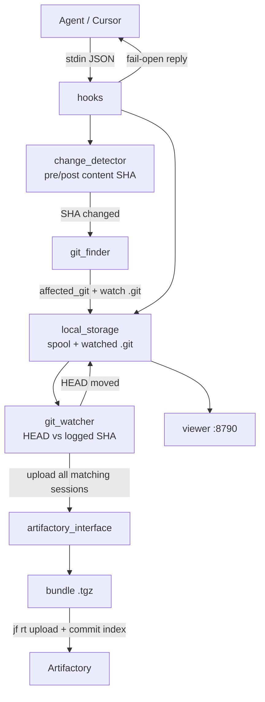
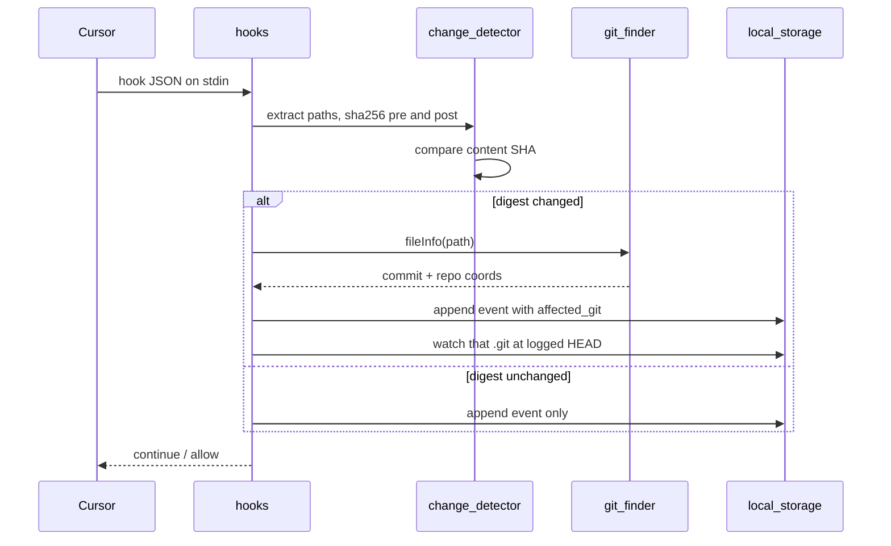
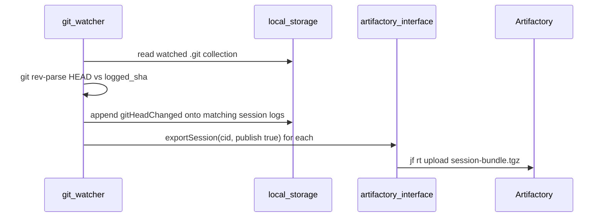

# Flow

Agent session evidence: Cursor hook JSON in, session-bundle `.tgz` out to Artifactory when a watched repo HEAD moves off the commit logged at file-change time. Viewer reads the same local spool.

`change_detector` hashes extracted paths on `preToolUse` and `postToolUse` and compares content SHA-256. Only a digest mismatch runs `git_finder`, which stamps `affected_git` on that event and adds the repo `.git` to the watched collection (logged SHA = HEAD at that moment). `git_watcher` polls `git rev-parse HEAD` against that logged SHA. HEAD moved → append the new commit onto those session logs and upload all of them. Hook `live_publish` is off unless `APPTRUST_LIVE_PUBLISH=1`.

## Per hook event

## On HEAD move

`artifactory_interface` reads the spool, builds a session view (timeline + change evidence), asks `git_finder` for repo/commit tags, packs `manifest.json` + `session.json` + `events.jsonl` into a `.tgz`, then `jf rt upload`.
